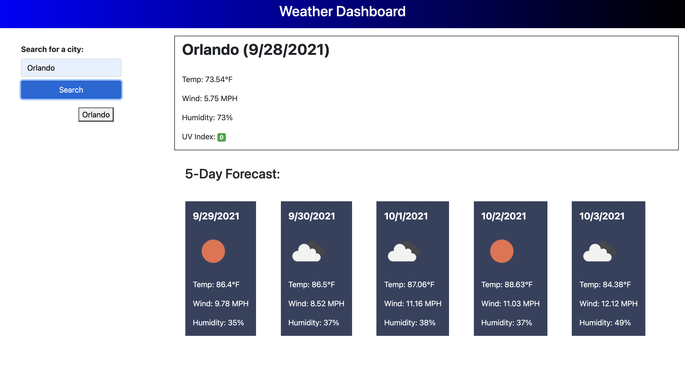

# Weather-Dashboard

This weather dashboard allows a user to input any city name and learn about current weather conditions as well as condition for the next 5 days.

# Features and Functionality

This dashboard allows a user to discover weather from whatever city they choose around the world. By using an input box and search button, this input is saved and an API call is made to the outside source OpenWeather to receive statistics about the current temperature, humidity, wind speed and UVI index. The UVI index has a color gauge around the number letting the viewer know how safe this number is. The viewer is then presented with a future forecast that has the same information by future date as well as imagery to describe the day, also received from the same API call source. All dates provided by moment.js. These cities are stored into local storage and populate under the search bar for the user to once again click if they would like and see the conditions.

Below is an image of the web page.

# Deployment Access

# License

https://openweathermap.org/api/one-call-api

